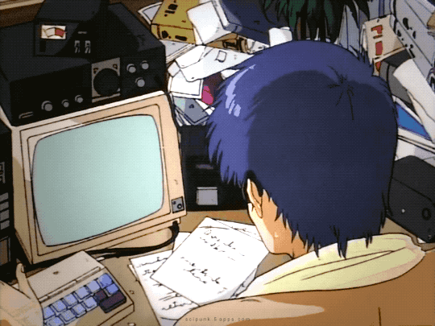

👋 Hey everyone, I'm Harsh Singh

I wish I could have five different lives!

<!--  -->

### Find me all around the web:

</a>
### Some Fun Facts about me:
I've founded a few companies in the past :zap: I love playing video games and you'll find me playing games on my [Twitch Channel](http://twitch.tv/MishManners) and live coding! I'm super into sports, including lots of outdoor adventures like hiking, snowboarding, and wakeboarding. You might run into me at an event, so make sure you follow my socials for all the updates. For a super quick live response, jump into my Twitch chat during a live stream. Or DM me on Instagram or Twitter.

## GitHub Stats

If you haven't had a chance to check out [GitHub Skyline](https://skyline.github.com/) yet, do it now. It's a 3D visualisation of your contribution graph. You can interact with your 3D graph, make a video, download the STL file, add annotations, and even view it in Virtual Reality - you'll need a phone and a Google Cardboard to do this, or you can break out the fancy VR headsets. You can also view the ASCII art, and if you know the code combination, you can view the Konami code (コナミコマンド).

As for the charts 🥧, if you like my A++ stats, then you can make your own by checking out the [GitHub Readme Stats Repo](https://github.com/anuraghazra/github-readme-stats) and [🔥 GitHub Readme Streak Stats](https://github-readme-streak-stats.herokuapp.com/demo/).

